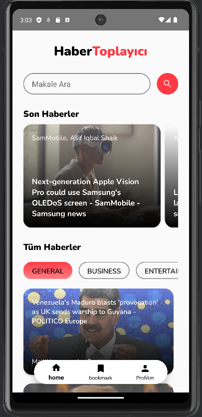
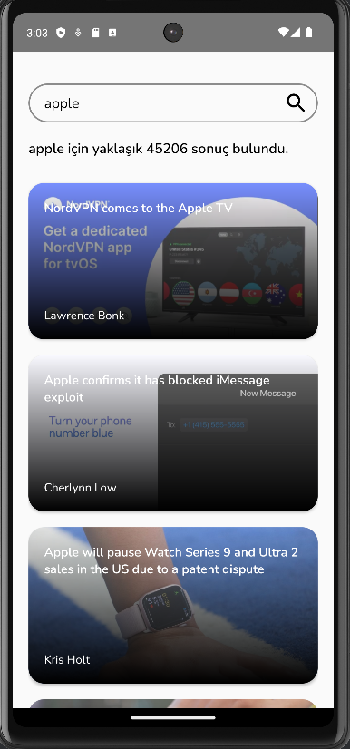
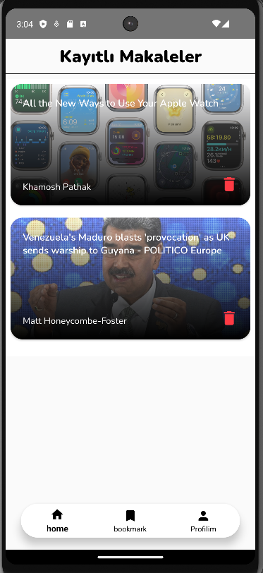
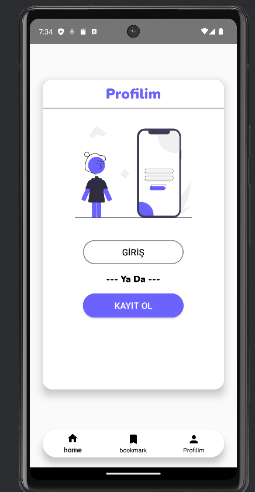
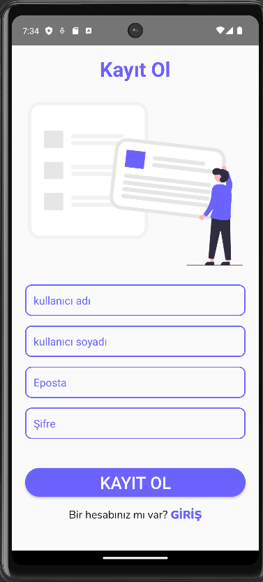
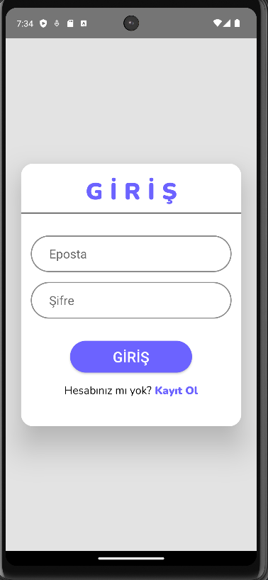
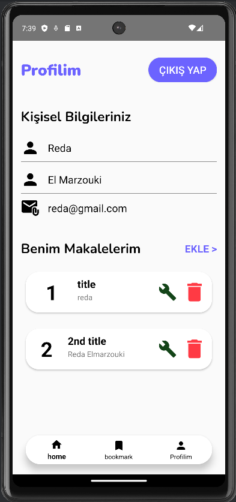
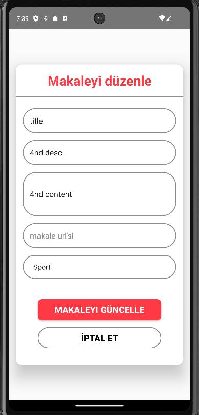
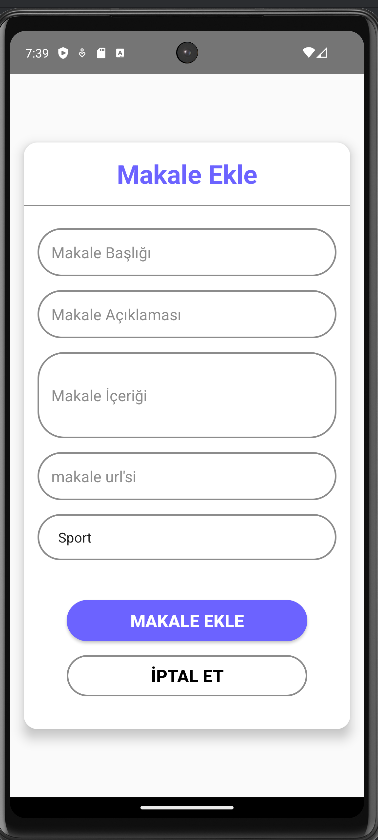

# NewsApp-Android-Studio

## Overview

NewsApp-Android-Studio is a feature-rich Android news application developed in Java using Android Studio. The app leverages the News API from [newsapi.org](https://newsapi.org/) to fetch and display the latest news articles. The user interface utilizes RecyclerViews for a smooth and responsive presentation of news items. One of the standout features includes the ability for users to save articles, with data storage and management handled by Firebase Realtime Database. Additionally, a custom Node.js API ([Mobile-News-App-API](https://github.com/Raderne/Mobile-News-App-API)) has been created to manage user authentication, registration, and article manipulation.

## Screenshots












## Features

- **News API Integration:** Real-time news articles are fetched from [newsapi.org](https://newsapi.org/).
- **RecyclerViews:** Utilizes RecyclerViews for efficient and dynamic display of news articles.
- **Firebase Realtime Database:** Enables users to save and delete articles, with data storage managed by Firebase.
- **User Authentication:** Implements a custom Node.js API for secure user login and registration.
- **Article Management:** The Node.js API facilitates the creation, retrieval, and deletion of articles.

## Prerequisites

Before running the project, ensure the following are set up:

- **Android Studio:** Install the latest version of Android Studio.
- **Firebase Account:** Set up a Firebase account and configure the project with Firebase Realtime Database.
- **Node.js:** Install Node.js to run the custom API.

## Setup

1. **Clone the Repository:**

```bash
git clone https://github.com/Raderne/NewsApp-Android-Studio.git
```

2. **Open the Project:**

Open the project in Android Studio.

3. **Configure Firebase:**

Connect the project with your Firebase account and configure the Firebase Realtime Database.

4. **Run the Node.js API:**

Navigate to the [Mobile-News-App-API](https://github.com/Raderne/Mobile-News-App-API) directory and follow the setup instructions in its README.

## Usage

1. **Launch the Android App:**

Run the Android app on an emulator or physical device.

2. **Explore News:**

Browse and view the latest news articles fetched from [newsapi.org](https://newsapi.org/).

3. **Save and Delete Articles:**

Interact with the UI to save or delete articles. Saved articles are stored in Firebase Realtime Database.

4. **User Authentication:**

Register and log in using the provided features, facilitated by the custom Node.js API.

## Contributing

If you wish to contribute to the project:

1. Fork the repository.
2. Create a new branch for your feature or bug fix.
3. Make changes and commit them.
4. Push your changes to your fork.
5. Submit a pull request to the original repository.

## Acknowledgments

- [News API](https://newsapi.org/)
- [Firebase](https://firebase.google.com/)
- [Node.js](https://nodejs.org/)

Thank you for your interest in my News App project! If you have any feedback or 
criticism, feel free to reach out.
